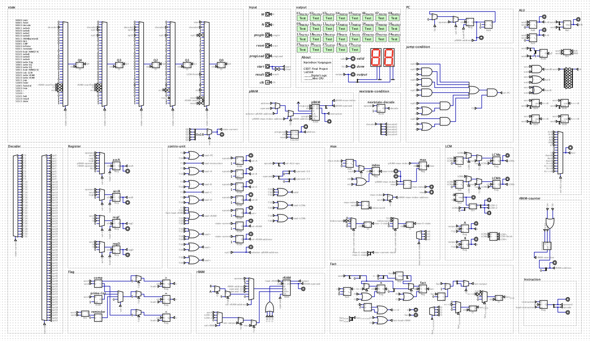

# 8-Bit Mini CPU (Digital Logic Design)

A custom 8-bit CPU architecture designed and simulated using **Digital** software. This project demonstrates the implementation of a Multiple Cycle / Pipeline processor with a custom instruction set.

*Figure 1: Complete Circuit Diagram of the Mini CPU*

## 📖 Project Overview
[cite_start]This project is part of the **Digital Logic (2110252)** course[cite: 1]. The goal was to design a CPU capable of executing a custom 14-bit instruction set to process data, perform arithmetic/logic operations, and handle control flow.

### Key Features
- [cite_start]**Architecture:** Multiple Cycle / Pipeline CPU (Non-Single Cycle)[cite: 37].
- [cite_start]**Memory:** - **Program RAM (pRAM):** 256 x 14 bits for instruction storage[cite: 2].
  - [cite_start]**Result RAM (rRAM):** 256 x 8 bits for data storage[cite: 2].
- [cite_start]**Data Width:** 8-bit Data Path[cite: 36].
- [cite_start]**Instruction Width:** 14-bit (6-bit Opcode, 8-bit Operand)[cite: 44].
- [cite_start]**I/O:** Handles asynchronous inputs (Start, Reset, ProgLoad) and 7-Segment display outputs [cite: 3-12].

## ⚙️ Instruction Set Architecture (ISA)
[cite_start]The CPU supports over 35 instructions, including complex operations like Prime Check and LCM[cite: 46, 48].

| Category | Examples |
|----------|----------|
| **Data Transfer** | `MOV`, Load/Store from RAM, Input M/N to Registers |
| **Arithmetic** | `ADD`, `SUB`, `MUL`, `DIV`, `MOD`, `POW` |
| **Logic** | `AND`, `OR`, `XOR`, `NOT`, `SHL`, `SHR` |
| **Control Flow** | `JUMP` (Unconditional), `JUMP if EQ/GR/LE` (Conditional) |
| **Special** | `isPrime` (Check prime number), `LCM` (Least Common Multiple) |

## 🛠️ How to Run
1. Download and install **[Digital](https://github.com/hneemann/Digital)**.
2. Clone this repository.
3. Open `src/main_cpu.dig` (or your main file name) in Digital.
4. Load the test program into the pRAM component.
5. Start the simulation.